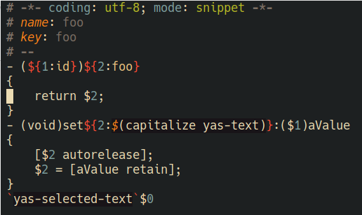

# Snippet major mode using tree-sitter

[](https://www.gnu.org/licenses/gpl-3.0)

This package provides a major-mode for yasnippet snippets using the tree-sitter
grammar from [tree-sitter-yasnippet](https://github.com/nverno/tree-sitter-yasnippet).

Features:
- font-locking
- basic indentation inside elisp code regions
- some interactive commands to move between fields and increment field indices.
- completion-at-point: for elisp in code regions and for snippet headers
- elisp xref in code regions

**WIP**: Use elisp parser in elisp code regions.



## Installing

Emacs 29.1 or above with tree-sitter support is required. 

Tree-sitter starter guide: https://git.savannah.gnu.org/cgit/emacs.git/tree/admin/notes/tree-sitter/starter-guide?h=emacs-29

### Install tree-sitter parser for yasnippet

Add the source to `treesit-language-source-alist`. 

```elisp
(add-to-list
 'treesit-language-source-alist
 '(yasnippet "https://github.com/nverno/tree-sitter-yasnippet"))
```

Optionally, install grammar for `elisp`.

Then run `M-x treesit-install-language-grammar` and select `yasnippet` to install.

### Install snippet-ts-mode.el from source

- Clone this repository
- Add the following to your emacs config

```elisp
(require "[cloned nverno/snippet-ts-mode]/snippet-ts-mode.el")
```
